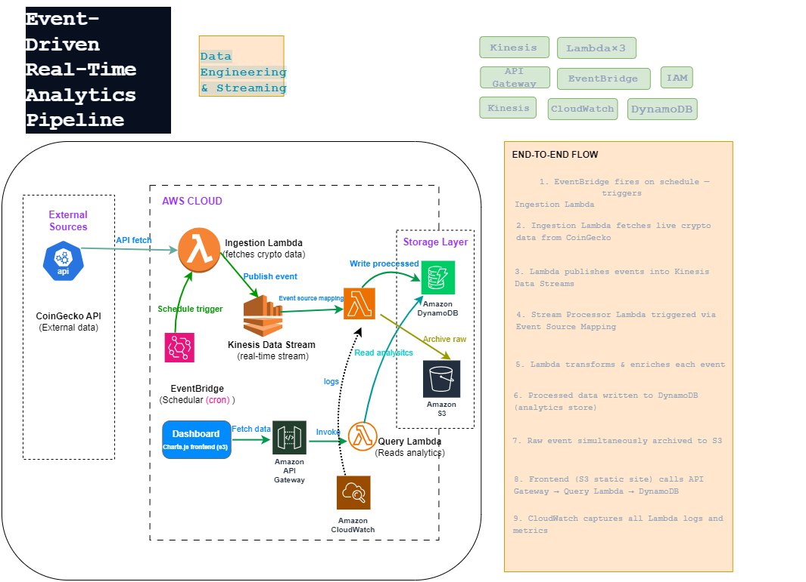
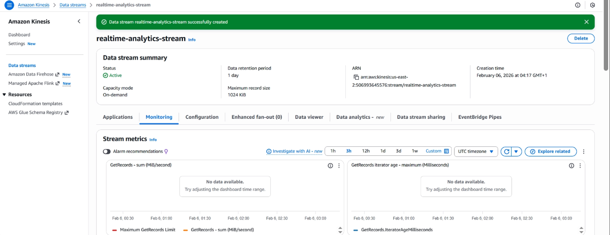
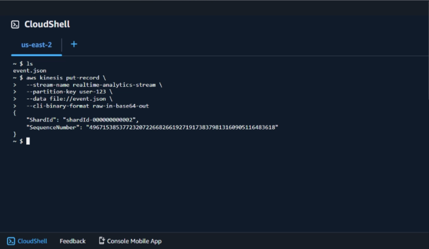
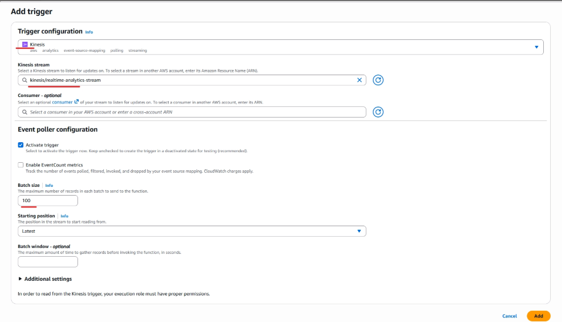
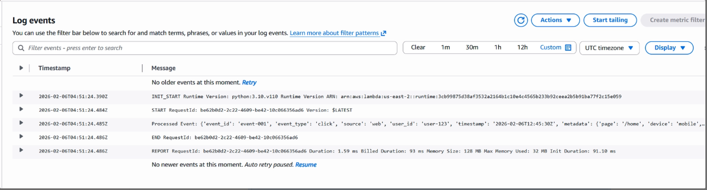
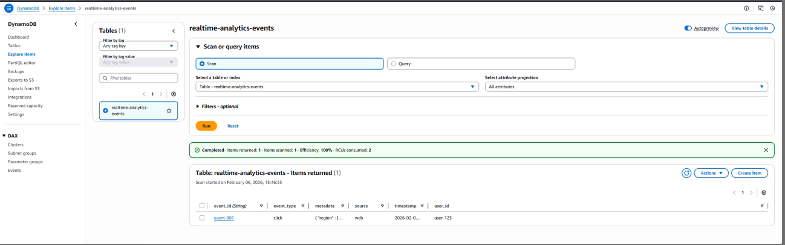
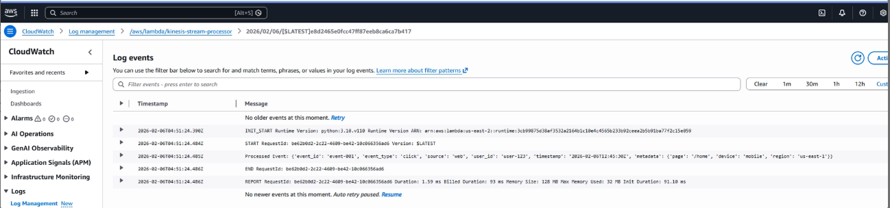
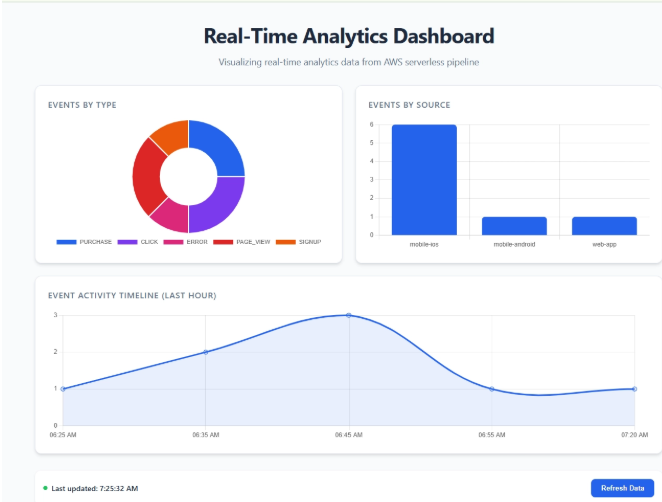

# Event-Driven Real-Time Data Analytics Pipeline on AWS


> **Read the full project write-up on Medium:** [link]
> **Connect on LinkedIn:** [link]

---

## TL;DR

A fully serverless, event-driven real-time analytics platform built on AWS. The system ingests live cryptocurrency market data from the CoinGecko API, streams it through Kinesis, processes and enriches events with Lambda, stores results in DynamoDB, exposes them via a secure API Gateway REST endpoint, and visualises insights on a hosted frontend dashboard. EventBridge automates the entire ingestion pipeline on a schedule with no manual triggers required.

---

## What This Project Demonstrates

- Designing and deploying a production-style real-time streaming analytics pipeline
- Building event-driven architecture with Kinesis Data Streams and Lambda triggers
- Integrating a live third-party API (CoinGecko) as a real streaming data source
- Storing and querying processed analytics data in DynamoDB
- Exposing streaming analytics via a CORS-enabled REST API
- Building and hosting a data visualisation dashboard on S3
- Automating pipeline execution using EventBridge scheduled rules
- End-to-end observability with CloudWatch

---

## Prerequisites

- AWS account with admin IAM user
- Basic understanding of REST APIs and JSON
- Familiarity with Python (Lambda functions are in Python)

---

## Architecture Diagram


CoinGecko API (Live Crypto Data)
│
▼
EventBridge Scheduled Rule
(Triggers every N minutes)
│
▼
Lambda — Data Producer
(Fetches crypto prices, publishes to Kinesis)
│
▼
Amazon Kinesis Data Streams
(real-time-analytics-stream)
│
▼
Lambda — Stream Processor
(Consumes Kinesis records, transforms & enriches)
│              │
▼              ▼
DynamoDB        Amazon S3
(Processed     (Raw event
analytics)     archive)
│
▼
API Gateway (REST API, CORS enabled)
│
▼
Lambda — API Handler
(Queries DynamoDB, returns analytics)
│
▼
S3 — Frontend Dashboard
(Chart.js visualisation, static website hosting)

**Observability:** CloudWatch Logs capture execution logs for all Lambda functions. CloudWatch Metrics monitor Kinesis shard throughput, Lambda invocations, and error rates.

## End-to-End Flow

### Manual / Test Path

1. A **test producer** (Lambda or script) generates an event and sends it to **Amazon Kinesis Data Streams**
2. **Stream Processor Lambda** is triggered by Kinesis (event source mapping)
3. Lambda processes and enriches the event record
4. Processed data is written to **Amazon DynamoDB** (analytics store)
5. Raw event is simultaneously archived to **Amazon S3** (raw storage)

### Automated / Live Data Path

1. **Amazon EventBridge** fires on a schedule (e.g. every 5 mins)
2. EventBridge triggers **CoinGecko Ingestion Lambda**
3. Lambda fetches live crypto price data from CoinGecko API
4. Lambda publishes events into **Kinesis Data Streams** — same pipeline picks up from step 2

### Query & Visualisation Path

1. **Frontend dashboard** (hosted on S3 static website) loads in browser
2. Dashboard makes API call to **Amazon API Gateway**
3. API Gateway triggers **Query Lambda** which reads from DynamoDB
4. Data returns to frontend and renders charts (Chart.js)
5. **CloudWatch** captures logs and metrics from all Lambda functions throughout


## AWS Services Used

| Service | Purpose |
|---|---|
| Amazon Kinesis Data Streams | Real-time streaming ingestion layer |
| AWS Lambda (Producer) | Fetches live crypto data from CoinGecko and publishes to Kinesis |
| AWS Lambda (Processor) | Consumes Kinesis stream, transforms events, writes to DynamoDB and S3 |
| AWS Lambda (API Handler) | Queries DynamoDB and returns analytics via API Gateway |
| Amazon DynamoDB | Stores processed analytics events for querying |
| Amazon S3 | Archives raw event JSON payloads and hosts the frontend dashboard |
| Amazon API Gateway | Exposes CORS-enabled REST API for the frontend |
| Amazon EventBridge | Schedules automated Lambda invocations for continuous data ingestion |
| Amazon CloudWatch | Logging and metrics across all pipeline components |
| AWS IAM | Least-privilege roles for each Lambda function |

---

## Data Model

The pipeline uses a flexible, generic event model that supports multiple event types without schema redesign:

```json
{
  "event_id": "uuid-string",
  "event_type": "crypto_price_update",
  "source": "coingecko",
  "timestamp": "2025-12-17T14:32:10Z",
  "user_id": "automated-producer",
  "metadata": {
    "coin": "bitcoin",
    "price_usd": 104250.33,
    "market_cap": 2063800000000,
    "volume_24h": 38400000000
  }
}
```

**DynamoDB table:**

| Setting | Value |
|---|---|
| Table Name | `AnalyticsEvents` |
| Partition Key | `event_id` (String) |
| Sort Key | `timestamp` (String) |
| Billing Mode | On-demand |

> [📸 Screenshot: DynamoDB table with processed analytics records]
> 

---

## Kinesis Stream Configuration

| Setting | Value |
|---|---|
| Stream Name | `real-time-analytics-stream` |
| Shard Count | 1 (sufficient for this project) |
| Retention Period | 24 hours |
| Data Record Size | Up to 1 MB per record |

> [📸 Screenshot: Kinesis stream in Active state showing shard metrics]
 


---

## Lambda Functions

### 1. Data Producer — `crypto-data-producer`

Fetches real-time cryptocurrency prices from CoinGecko API for Bitcoin, Ethereum, and Solana. Formats each coin as a standardised event record and publishes it to the Kinesis stream using `put_record`.

**IAM permissions:** `kinesis:PutRecord` on the analytics stream.

> [📸 Screenshot: Lambda function test execution showing successful Kinesis PutRecord]
> 

---

### 2. Stream Processor — `kinesis-stream-processor`

Triggered by Kinesis stream events (event source mapping configured with batch size of 10). Decodes base64 Kinesis records, transforms and enriches the event data, writes processed records to DynamoDB using `PutItem`, and archives raw JSON to S3 using `PutObject`.

**IAM permissions:** `dynamodb:PutItem` on `AnalyticsEvents`, `s3:PutObject` on the raw events bucket.

> [📸 Screenshot: Lambda event source mapping showing Kinesis trigger configuration]
> 
> [📸 Screenshot: CloudWatch logs confirming successful processing and DynamoDB write]
>  
> 

---

### 3. API Handler — `analytics-api-handler`

Queries the DynamoDB `AnalyticsEvents` table using Scan with optional filters. Returns results as a JSON response compatible with the frontend dashboard.

**IAM permissions:** `dynamodb:Scan` on `AnalyticsEvents`.

> [📸 Screenshot: API Gateway test returning JSON analytics records]

---

## EventBridge Automation

The pipeline runs continuously without manual triggers using an EventBridge scheduled rule.

| Setting | Value |
|---|---|
| Rule Name | `crypto-ingestion-schedule` |
| Schedule | `rate(5 minutes)` |
| Target | `crypto-data-producer` Lambda |
| State | Enabled |

> > [📸 Screenshot: Lambda invocation metrics in CloudWatch showing regular automated executions]
> 

---

## Frontend Dashboard

Hosted on Amazon S3 with static website hosting enabled. The dashboard fetches data from the API Gateway endpoint and renders four visualisations using Chart.js:

- Event type distribution (bar chart)
- Source distribution (pie chart)
- Event activity timeline (line chart)
- Raw event table with timestamps and metadata

> [📸 Screenshot: Live dashboard in browser showing crypto event charts]
> 
> [📸 Screenshot: S3 bucket with static website hosting configuration]
> 

---

## Implementation Breakdown

| Implementation | What Was Built |
|---|---|
| 1. Kinesis Setup | Stream created, producer Lambda deployed, test events published and verified |
| 2. Stream Processing | Processor Lambda deployed with Kinesis trigger, DynamoDB writes confirmed |
| 3. Analytics Storage | DynamoDB table configured, records queried and validated |
| 4. API Layer | API Gateway REST API deployed, CORS configured, endpoint live |
| 5. Monitoring | CloudWatch dashboards and alarms configured across all functions |
| 6. Raw Archival | S3 raw events bucket configured, Processor Lambda writes confirmed |
| 7. Frontend | Dashboard deployed to S3, charts rendering API data correctly |
| 8. Live Automation | EventBridge schedule running, continuous crypto data flowing through full pipeline |

---

## Key Design Decisions

**Why Kinesis instead of SQS for ingestion?**
Kinesis is purpose-built for real-time streaming at scale. It preserves event ordering within shards, supports multiple consumers on the same stream, and retains data for replay. SQS is better suited for task queues — Kinesis is the right choice when the use case is streaming analytics.

**Why archive raw events to S3?**
DynamoDB stores processed, queryable analytics data. S3 stores the raw event payloads before any transformation. This separation supports historical reprocessing (if the processing logic changes, you can reprocess from S3 without losing original data) and is the standard pattern in production data platforms.

**Why EventBridge for scheduling instead of a cron Lambda?**
EventBridge is the AWS-native event scheduler. It decouples the scheduling concern from the function logic, supports complex schedule expressions, and integrates directly with Lambda without custom polling code.

**Why a generic event model?**
A rigid schema that only supports crypto events would require redesign for any new data source. The generic event model with a `metadata` field accommodates any event type — application events, system logs, IoT data — without touching the architecture.

---

## Skills Demonstrated

- Real-time streaming architecture with Kinesis Data Streams
- Event-driven compute with Lambda triggers
- Data pipeline design (ingest → process → store → expose → visualise)
- Third-party API integration as a live data source
- DynamoDB schema design for analytics workloads
- REST API development and CORS configuration with API Gateway
- Frontend data visualisation deployment on S3
- Pipeline automation with EventBridge
- Observability with CloudWatch logs and metrics

## Key Points
- This is the most impressive diagram of the 5 — event-driven, streaming, full-stack cloud architecture
- Event source mapping on Kinesis → Lambda is how Lambda "listens" to a stream — no polling code needed
- Why both DynamoDB AND S3? DynamoDB for fast querying (millisecond reads), S3 for cheap long-term archival and reprocessing
- EventBridge is the "scheduler" — think of it as a cloud cron job, no server needed
- CloudWatch is non-negotiable in production — always show it in the diagram

## Related

- Medium article: [link]
